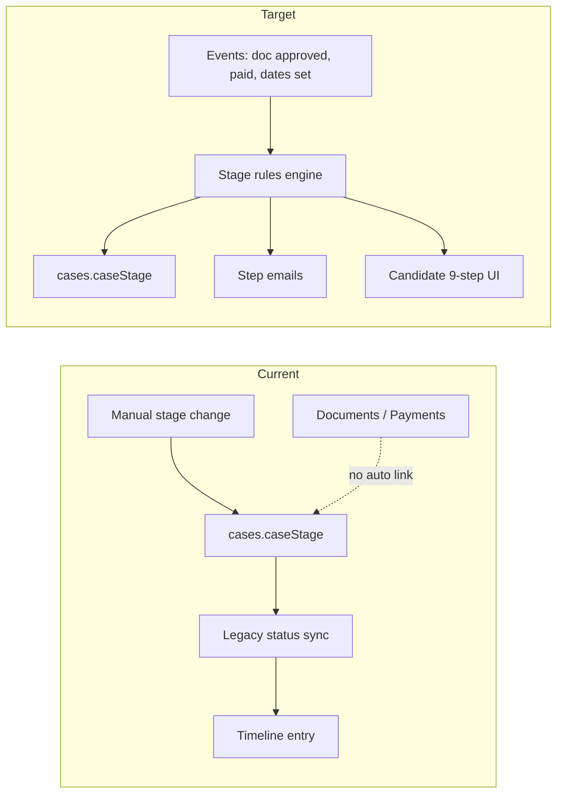

# Standard Immigration Case Process — Feasibility Analysis

**Date:** May 2026  
**Repos:** `EPiC_API` (backend), `EPiC_New_Panels` (frontend)  
**Official spec:** `EPiC_API/Standard Immigration Case Process.docx`  
**Question:** Can this process be supported for cases in EPiC?

---

## Executive summary

| Verdict | Detail |
|--------|--------|
| **Possible?** | **Yes** — the Word document defines **16 steps**; the codebase implements the **same 16 steps** in `immigrationCaseProcess.js` (1:1 on wording and order). |
| **Ready today?** | **Partially** — pipeline Kanban, `caseStage` on cases, timeline, documents, payments, messaging, and application-pack downloads exist. |
| **Main gaps** | No first-class **Data Capture Sheet** or **CCL** artifacts; **no automatic stage progression** from events; candidate **Application Status** still uses legacy 8-step `status` labels; step-specific **email automation** is not wired. |

**Recommendation:** Use the **docx / `IMMIGRATION_CASE_STEPS`** as the single source of truth. Optionally group steps into ~9 phases for a simpler candidate UI without changing `caseStage` ids.

---

## Official document (`Standard Immigration Case Process.docx`)

The docx is the firm’s canonical process. Extracted text (16 sentences, in order):

1. Client contacts us with an immigration query.
2. Initial consultation is conducted to assess eligibility and visa options.
3. Data Capture Sheet sent by visa category; mandatory docs requested (Passport, BRP/eVisa, Driving licence if applicable).
4. Once documents and Data Capture Sheet are received, application form preparation begins.
5. Caseworker reviews documents and identifies missing information or additional documents required.
6. Further information/documents are requested from the client where necessary.
7. Draft application form prepared and sent to the client for review and confirmation.
8. After client approval of the draft, the Client Care Letter (CCL) is issued.
9. Signed CCL and required payments are received from the client.
10. Final application is submitted to the Home Office.
11. Biometrics appointment is booked.
12. Biometrics confirmation email/instructions sent to the client.
13. Supporting documents uploaded prior to the biometrics appointment.
14. Application status monitored while awaiting Home Office decision.
15. Approval/refusal email and decision documents sent to the client.
16. Final case closure email is issued.

### Docx ↔ code alignment (verified)

| # | Docx (summary) | `caseStage` id | Code title | Match |
|---|----------------|----------------|------------|-------|
| 1 | Client enquiry | `client_enquiry` | Client Enquiry | ✅ |
| 2 | Initial consultation | `initial_consultation` | Initial Consultation | ✅ |
| 3 | Data Capture + mandatory docs | `data_capture_initial_docs` | Data Capture & Initial Documents | ✅ |
| 4 | Application preparation begins | `application_preparation` | Application Preparation | ✅ |
| 5 | Caseworker document review | `document_review` | Document Review | ✅ |
| 6 | Further info/documents requested | `further_information_request` | Further Information Request | ✅ |
| 7 | Draft sent for client review | `draft_application_review` | Draft Application Review | ✅ |
| 8 | CCL issued after draft approval | `ccl_issued` | Client Care Letter Issued | ✅ |
| 9 | Signed CCL + payments received | `ccl_payment_received` | CCL & Payment Received | ✅ |
| 10 | Submitted to Home Office | `application_submitted` | Application Submitted | ✅ |
| 11 | Biometrics booked | `biometrics_booked` | Biometrics Booked | ✅ |
| 12 | Biometrics confirmation sent | `biometrics_confirmation_sent` | Biometrics Confirmation Sent | ✅ |
| 13 | Docs uploaded before biometrics | `documents_uploaded` | Documents Uploaded | ✅ |
| 14 | Awaiting decision | `awaiting_decision` | Awaiting Decision | ✅ |
| 15 | Decision communicated | `decision_communicated` | Decision Communicated | ✅ |
| 16 | Case closure email | `case_closure` | Case Closure | ✅ |

Constants live in (keep in sync when the docx changes):

| File |
|------|
| `EPiC_API/src/constants/immigrationCaseProcess.js` |
| `EPiC_New_Panels/src/constants/immigrationCaseProcess.js` |

### Optional: 9-phase grouping (for simpler candidate UI only)

| Phase | Docx steps | `caseStage` ids |
|-------|------------|-----------------|
| Contact & consultation | 1–2 | `client_enquiry`, `initial_consultation` |
| Onboarding & documents | 3 | `data_capture_initial_docs` |
| Preparation & review | 4–6 | `application_preparation`, `document_review`, `further_information_request` |
| Draft review | 7 | `draft_application_review` |
| CCL & payment | 8–9 | `ccl_issued`, `ccl_payment_received` |
| Submission | 10 | `application_submitted` |
| Biometrics | 11–13 | `biometrics_booked`, `biometrics_confirmation_sent`, `documents_uploaded` |
| Decision | 14–15 | `awaiting_decision`, `decision_communicated` |
| Closure | 16 | `case_closure` |

Legacy `cases.status` is a coarser filter; `caseStage` should drive workflow UI per the docx.

---

## Backend analysis (`EPiC_API`)

### What exists

| Area | Implementation | Notes |
|------|----------------|-------|
| **Case workflow field** | `cases.caseStage` (VARCHAR 64), default `client_enquiry` | Migration: `tenant_001_workflow_and_documents.sql`, `006_core_business_tables.sql` |
| **Legacy status** | `cases.status` ENUM (Lead, Docs Pending, Drafting, Submitted, …) | Mapped ↔ `caseStage` via `LEGACY_STATUS_TO_STAGE` / `STAGE_TO_LEGACY_STATUS` |
| **Stage constants** | `IMMIGRATION_CASE_STEPS` (16 items) | Single source of truth for valid stages |
| **Pipeline API** | `GET` pipeline grouped by stage; `PATCH /api/cases/:id/stage` | `case.controller.js` — `updatePipelineStage` updates `caseStage` + syncs legacy `status` + timeline |
| **Case detail updates** | `PATCH` case detail with `caseStage`, dates | `caseDetail.controller.js` — `biometricsDate`, `submissionDate`, `decisionDate` |
| **Timeline** | `case_timeline` table + `caseTimeline.service.js` | Actions: `status_changed`, `document_uploaded`, `document_reviewed`, `payment_received`, communications, etc. |
| **Documents** | Upload, review (approve/reject), checklist by visa type | `document.controller.js`, `document_checklists` table |
| **Payments** | `totalAmount`, `paidAmount`, `amountStatus` on case | Supports CCL/payment tracking at data level, not CCL document type |
| **Candidate application pack** | PDF/ZIP download endpoints | `candidateApplication.routes.js` — filled form PDF, case summary PDF, supporting docs ZIP |
| **Onboarding** | New cases get `caseStage: client_enquiry` | `candidateOnboarding.service.js`, admin/caseworker case create |
| **Email templates (tenant)** | `email_templates` — keys: `payment`, `doc`, `opened`, `expiry`, `welcome` | Admin-editable; not mapped to workflow steps |

### Gaps / not implemented on backend

| Gap | Impact on docx steps |
|-----|------------------------|
| **No `data_capture_sheets` table or API** | Step 2 — “send Data Capture Sheet by visa category” is manual/off-system |
| **No CCL entity** (unsigned/signed CCL, version, e-sign) | Step 5 — only generic documents + payments |
| **No automatic `caseStage` transitions** | Moving stages requires caseworker/admin action (pipeline drag or case detail) |
| **No step-triggered emails** | Biometrics confirmation, decision, closure emails are not fired by stage change |
| **Email templates not aligned to 16 steps** | Only 5 generic templates seeded |
| **Consultation scheduling** | No consultation appointment model; visa enquiry creates lead-style flow only |
| **`further_information_request` not auto-set** | Rejected/missing docs do not move stage automatically |
| **Sponsor worker `caseStage: 'Initial'`** | Invalid stage id — should use `client_enquiry` or valid constant |

### Key backend files

```
EPiC_API/src/constants/immigrationCaseProcess.js
EPiC_API/src/models/tenant/case.model.js
EPiC_API/src/modules/Admin/case.controller.js          # pipeline + PATCH stage
EPiC_API/src/modules/Admin/Dashboard/caseDetail.controller.js
EPiC_API/src/services/caseTimeline.service.js
EPiC_API/src/controllers/document.controller.js          # shared document ops
EPiC_API/src/modules/Candidate/Application/candidateApplication.controller.js
EPiC_API/src/migrations/tenants/tenant_001_workflow_and_documents.sql
EPiC_API/src/migrations/tenants/20260430130000-create-case-timeline.sql
EPiC_API/src/migrations/tenants/20260427170000-create-document-checklist.sql
```

---

## Frontend analysis (`EPiC_New_Panels`)

### What exists

| Area | Where | Fit to docx flow |
|------|--------|-------------------|
| **16-step constants + UI helpers** | `src/constants/immigrationCaseProcess.js` | Mirrors API; `resolveCaseStage`, progress %, pipeline cards |
| **Caseworker pipeline (live API)** | `src/pages/caseworker/Pipeline.jsx` | Drag-and-drop Kanban → `updatePipelineStage` |
| **Admin pipeline** | `src/pages/admin/AdminPipeline.jsx` | Same pattern |
| **Case workflow on detail** | `CaseWorkflowPanel`, `CaseWorkflowProgress`, `CaseStageSelect`, `CaseWorkflowBadge` | Used on admin/caseworker case detail |
| **Candidate dashboard progress** | `CandidateDashboard.jsx` | Shows 16-step progress from `caseStage` / `status` |
| **Visa enquiry (step 1 entry)** | `CandidateVisaEnquiry.jsx` | Creates enquiry; copy references standard process |
| **Documents & checklist** | `DocumentChecklist.jsx`, `UploadDocuments.jsx`, caseworker docs | Steps 2–3, 7 (uploads) |
| **Application pack downloads** | `CandidateAccount.jsx` → `useDownloads` / `downloadApi.js` | Filled PDF, ZIP, case summary — **wired to API** |
| **Messages / comms** | Caseworker `Cases.jsx` CommsTab, candidate messages | Supports consultation and ongoing comms (manual) |
| **Payments UI** | Candidate payments + admin billing | Step 5 (payment leg) |
| **Admin process reference (mock)** | `AdminImmigrationProcess.jsx` + `immigrationProcessMock.js` | **Demo/mock** per-step actions & doc lists — not production data |

### Gaps / inconsistencies on frontend

| Gap | Detail |
|-----|--------|
| **`ApplicationStatus.jsx` uses 8 legacy stages** | Driven by `caseData.status` only — **does not use `caseStage` or 16-step config**. Misaligned with dashboard workflow bar. |
| **Application pack “final documents”** | `FINAL_ITEMS` hardcoded `available: false` — decision letter / BRP not tied to `decision_communicated` or real files |
| **No Data Capture Sheet UI** | No send/fill/upload flow for visa-specific capture sheet |
| **No CCL workflow UI** | No dedicated issue → sign → payment gate before submission |
| **No biometrics scheduling UI** | `biometricsDate` on case exists in API model but limited candidate-facing surfacing |
| **Stage change is manual** | No “advance to next step” wizard tied to checklist completion |
| **Sidebar “Application Pack”** | Routes to `/candidate/account` (downloads tab); naming vs `tab` query param is implicit |

### Key frontend files

```
EPiC_New_Panels/src/constants/immigrationCaseProcess.js
EPiC_New_Panels/src/pages/caseworker/Pipeline.jsx
EPiC_New_Panels/src/pages/candidate/ApplicationStatus.jsx      # needs alignment
EPiC_New_Panels/src/pages/candidate/CandidateDashboard.jsx
EPiC_New_Panels/src/pages/candidate/CandidateAccount.jsx
EPiC_New_Panels/src/components/case/CaseWorkflowProgress.jsx
EPiC_New_Panels/src/data/immigrationProcessMock.js             # reference only
```

---

## Step-by-step: can EPiC do it today?

| Step | Possible? | Today | To reach full automation |
|------|-----------|-------|---------------------------|
| **1. Contact & consultation** | Yes | Visa enquiry, messages, `client_enquiry` → `initial_consultation` manual | Consultation entity, calendar, auto-advance on enquiry accept |
| **2. Onboarding & docs** | Yes | Document checklist by visa type, upload, caseworker review | Data Capture Sheet template per visa + “send to candidate” action |
| **3. Preparation & gaps** | Yes | Docs + messages + stages `application_preparation` / `document_review` / `further_information_request` | Auto stage on all required docs approved; task list from mock → real |
| **4. Draft review** | Yes | Stage `draft_application_review`; draft PDF in application pack | Client approve/reject draft + audit trail |
| **5. CCL & payment** | Partial | Payments on case; stage `ccl_*`; no CCL doc type | CCL template, e-sign, block submission until paid + signed |
| **6. Submission** | Yes | Stage + `submissionDate` field | Hook to external HO submission (if needed) |
| **7. Biometrics** | Partial | Three substages + `biometricsDate` | Booking integration, templated confirmation email, pre-bio upload checklist |
| **8. Monitoring & decision** | Yes | `awaiting_decision`, notifications prefs, timeline | Decision doc upload unlocks candidate final downloads |
| **9. Closure** | Yes | `case_closure` stage + timeline `case_closed` | Automated closure email from template |

---

## Architecture (current vs target)



---

## Recommended implementation plan

### Phase 1 — Align UX (low effort, high value)

1. Refactor `ApplicationStatus.jsx` to use `resolveCaseStage` + a **9-step display config** (group the 16 ids).
2. Show same progress component as `CandidateDashboard` (`CaseWorkflowProgress`).
3. Fix sponsor `caseStage: 'Initial'` → valid stage in API.

### Phase 2 — Operational artifacts (medium effort)

1. **Data Capture Sheet:** `data_capture_templates` (visa_type_id, fields JSON) + candidate form submission API.
2. **CCL:** document type `client_care_letter` + status workflow (issued → signed) + payment gate flag on case.
3. Expand `email_templates` seeds: `ccl_issued`, `biometrics_confirmation`, `decision`, `case_closure`.

### Phase 3 — Automation (medium–high effort)

1. **Stage rules** (config or code): e.g. all required checklist docs approved → suggest/advance to `application_preparation`.
2. On `PATCH .../stage`, optional email dispatch from template key per stage.
3. Unlock `FINAL_ITEMS` when `caseStage` is `decision_communicated` and decision documents exist.

### Phase 4 — Caseworker guidance (optional)

1. Replace `immigrationProcessMock.js` usage in admin with live case context (actions/docs per stage from checklist + templates).
2. Per-stage task checklist on case detail drawer.

---

## Effort estimate (rough)

| Phase | Backend | Frontend | Total |
|-------|---------|----------|-------|
| Phase 1 — UX alignment | 0.5 d | 1–2 d | **1.5–2.5 d** |
| Phase 2 — DCS + CCL + templates | 3–5 d | 2–3 d | **5–8 d** |
| Phase 3 — Automation + emails | 4–6 d | 1–2 d | **5–8 d** |
| Phase 4 — Guided caseworker UI | 1–2 d | 2–3 d | **3–5 d** |

**Full docx-aligned production flow (automation + DCS + CCL):** ~**15–23 developer-days** depending on e-sign, email provider, and how strict payment/submission gates must be.

---

## Answer: “Can we add cases for this flow?”

**Yes.** New cases already receive `caseStage: client_enquiry` and can be moved through all stages via:

- Caseworker/admin **pipeline** (drag-and-drop), or  
- **Case detail** workflow selector / status PATCH.

You do **not** need a new case type table — you need:

1. **Consistent UI** (candidate status = same model as pipeline).  
2. **Missing artifacts** (Data Capture Sheet, CCL).  
3. **Optional automation** so the process does not rely entirely on manual stage updates.

---

## Maintenance note

Keep `EPiC_API` and `EPiC_New_Panels` copies of `immigrationCaseProcess.js` in sync when adding or renaming stages. If you collapse to a strict **9-step** public API, add a `BUSINESS_STEPS` array that groups the 16 ids rather than deleting internal substages (pipeline columns depend on granularity).

---

## Related docs in repo

- `EPiC_New_Panels/src/docs/NotificationSystem.md` — in-app notifications (complements email gaps above).
